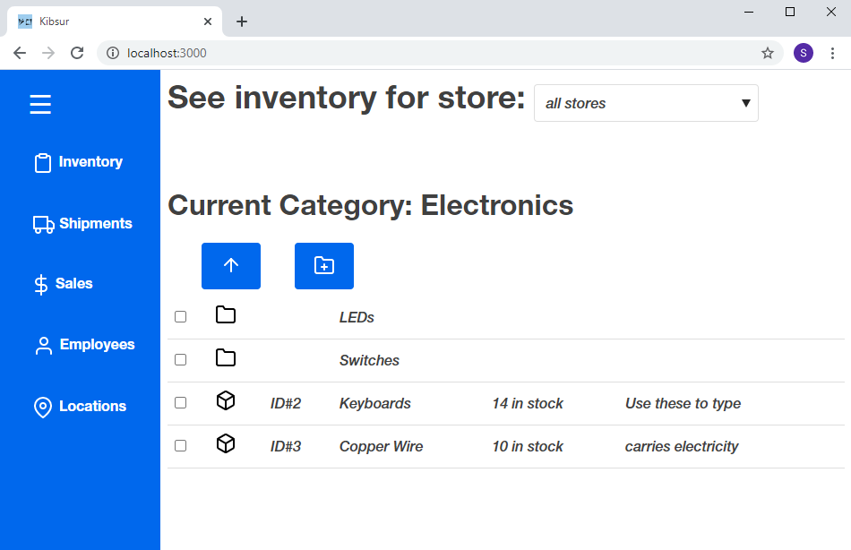
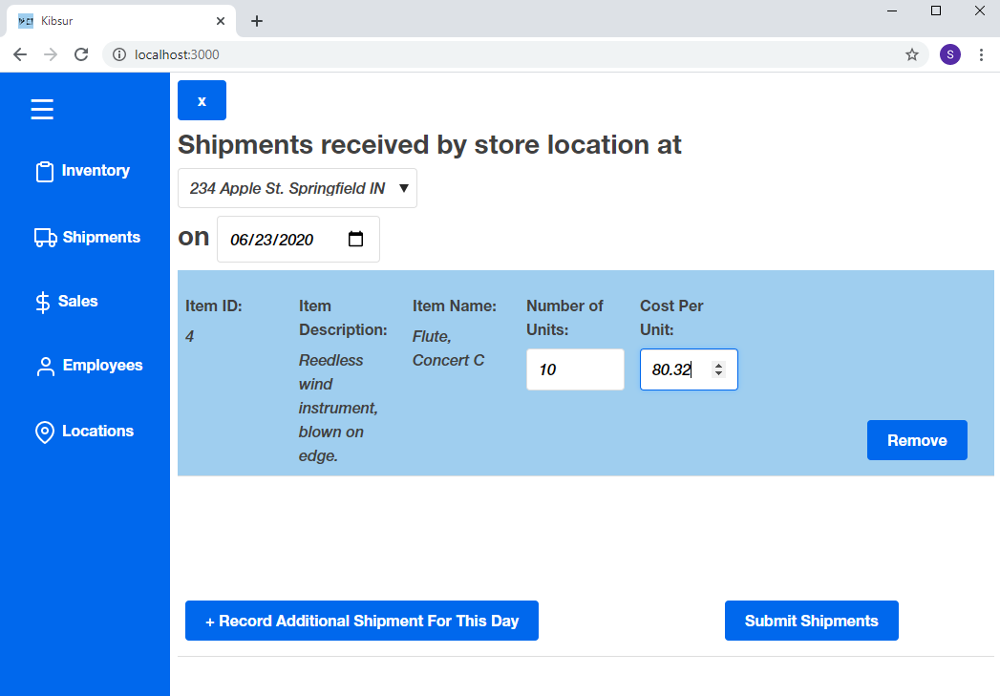

# Kibsur

Kibsur is a software for tracking inventory, shipments, sales, and employees across multiple store locations. Kibsur is Sumerian for "one's belongings", or "what is present".
This project is currently under development.

## Getting Started

### Prerequisites

In order to get Kibsur up and running on your machine, you will need to install the following:

* [Node.js](https://nodejs.org/en/download/)
* [MySQL](https://dev.mysql.com/downloads/installer/)

### Installing

In order to get started with Kibsur, you will need a session of MySQL running on your system. Edit the application.properties file, setting the spring.datasource.username and spring.datasource.password to the username and password of a MySQL user with schema-creation privileges on your server. If a schema does not already exist for this application, one will be created automatically when you run it.

Import the project in your favorite IDE (I suggest IntelliJ IDEA, though others will work). Run the main function in KibsurApplication.java. This should start up the REST API that acts as the back-end of the program. Next, use the IDE to open a terminal in the kibsur-react-app folder and run the command `npm start`. The front-end of the application should be running.
You can now use the app by going to your internet browser and going to http://localhost:3000/

## Built With

* [Spring Boot](https://spring.io/projects/spring-boot) - Framework used to build the RESTful API
* [React](https://reactjs.org/) - Framework used to build the UX
* [Maven](https://maven.apache.org/) - Dependency Management
* [Feather](https://feathericons.com/) - Opensource Icons
* [Primitive](https://taniarascia.github.io/primitive/) - Opensource boilerplate CSS Style Sheet

## License

This project is licensed under the GNU General Public License - see the LICENSE file for details

